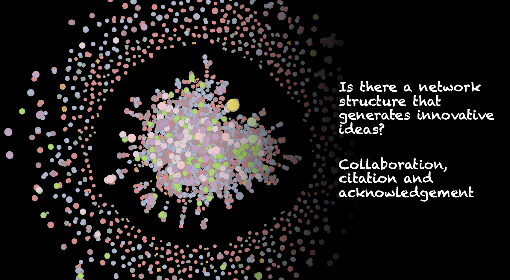

## Acknowledgement network

The research in the academic world represents scientists’ human relationships, and it significantly contributes to innovations and acceleration of science. However, there are many contributed intercommunications which are neither citation nor collaboration relationships. Here, we take into account them by applying acknowledgement description, and seek new insight into scientists’ world, establishing and understanding the network based on the acknowledgement relationships.

## Research Internship 
- **g-RIPS (Graduate-level Research in Industrial Projects for Students Sendai)** (*June 2021 - August 2021*)  
International research program hosted by the Tohoku Univ. and UCLA.  
Project: Optimization of wireless base station placement as an 
an essential foundation for our future IoT society.

- **R&D Summer Internship at [OPTiM Corporation](https://www.optim.com/)** (*September 2020 – October 2020*)  
    Project: CNN-based crowd counting